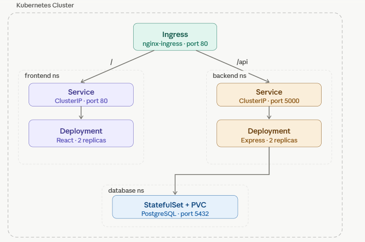

**Directory structure:**
```
k8s/
├── namespace.yaml
├── frontend/
│   ├── deployment.yaml
│   ├── service.yaml
│   └── hpa.yaml
├── backend/
│   ├── deployment.yaml
│   ├── service.yaml
│   ├── hpa.yaml
│   └── configmap.yaml
├── database/
│   ├── statefulset.yaml
│   ├── service.yaml
│   └── pvc.yaml
├── secrets/
│   └── db-secret.yaml
└── ingress/
    └── ingress.yaml
```

---

### `k8s/namespace.yaml`
```yaml
apiVersion: v1
kind: Namespace
metadata:
  name: frontend
---
apiVersion: v1
kind: Namespace
metadata:
  name: backend
---
apiVersion: v1
kind: Namespace
metadata:
  name: database
```

---

### `k8s/secrets/db-secret.yaml`
```yaml
apiVersion: v1
kind: Secret
metadata:
  name: db-secret
  namespace: backend
type: Opaque
stringData:
  POSTGRES_DB: appdb
  POSTGRES_USER: appuser
  POSTGRES_PASSWORD: supersecret
---
apiVersion: v1
kind: Secret
metadata:
  name: db-secret
  namespace: database
type: Opaque
stringData:
  POSTGRES_DB: appdb
  POSTGRES_USER: appuser
  POSTGRES_PASSWORD: supersecret
```

---

### `k8s/backend/configmap.yaml`
```yaml
apiVersion: v1
kind: ConfigMap
metadata:
  name: backend-config
  namespace: backend
data:
  DB_HOST: "postgres-svc.database.svc.cluster.local"
  DB_PORT: "5432"
```

---

### `k8s/database/pvc.yaml`
```yaml
apiVersion: v1
kind: PersistentVolumeClaim
metadata:
  name: postgres-pvc
  namespace: database
spec:
  accessModes:
    - ReadWriteOnce
  resources:
    requests:
      storage: 5Gi
```

---

### `k8s/database/statefulset.yaml`
```yaml
apiVersion: apps/v1
kind: StatefulSet
metadata:
  name: postgres
  namespace: database
spec:
  serviceName: postgres-svc
  replicas: 1
  selector:
    matchLabels:
      app: postgres
  template:
    metadata:
      labels:
        app: postgres
    spec:
      securityContext:
        fsGroup: 999
      containers:
        - name: postgres
          image: postgres:16-alpine
          ports:
            - containerPort: 5432
          env:
            - name: POSTGRES_DB
              valueFrom:
                secretKeyRef:
                  name: db-secret
                  key: POSTGRES_DB
            - name: POSTGRES_USER
              valueFrom:
                secretKeyRef:
                  name: db-secret
                  key: POSTGRES_USER
            - name: POSTGRES_PASSWORD
              valueFrom:
                secretKeyRef:
                  name: db-secret
                  key: POSTGRES_PASSWORD
            - name: PGDATA
              value: /var/lib/postgresql/data/pgdata
          volumeMounts:
            - name: postgres-storage
              mountPath: /var/lib/postgresql/data
          resources:
            requests:
              cpu: "250m"
              memory: "256Mi"
            limits:
              cpu: "500m"
              memory: "512Mi"
          livenessProbe:
            exec:
              command: ["pg_isready", "-U", "appuser", "-d", "appdb"]
            initialDelaySeconds: 30
            periodSeconds: 10
            failureThreshold: 5
          readinessProbe:
            exec:
              command: ["pg_isready", "-U", "appuser", "-d", "appdb"]
            initialDelaySeconds: 10
            periodSeconds: 5
      volumes:
        - name: postgres-storage
          persistentVolumeClaim:
            claimName: postgres-pvc
```

---

### `k8s/database/service.yaml`
```yaml
apiVersion: v1
kind: Service
metadata:
  name: postgres-svc
  namespace: database
spec:
  selector:
    app: postgres
  ports:
    - port: 5432
      targetPort: 5432
  clusterIP: None  # Headless — required for StatefulSet DNS
```

---

### `k8s/backend/deployment.yaml`
```yaml
apiVersion: apps/v1
kind: Deployment
metadata:
  name: backend
  namespace: backend
spec:
  replicas: 2
  selector:
    matchLabels:
      app: backend
  template:
    metadata:
      labels:
        app: backend
    spec:
      securityContext:
        runAsNonRoot: true
        runAsUser: 1000
      containers:
        - name: backend
          image: your-registry/backend:latest   # replace with your image
          imagePullPolicy: Always
          ports:
            - containerPort: 5000
          envFrom:
            - configMapRef:
                name: backend-config
            - secretRef:
                name: db-secret
          resources:
            requests:
              cpu: "100m"
              memory: "128Mi"
            limits:
              cpu: "250m"
              memory: "256Mi"
          livenessProbe:
            httpGet:
              path: /api/health
              port: 5000
            initialDelaySeconds: 15
            periodSeconds: 20
          readinessProbe:
            httpGet:
              path: /api/health
              port: 5000
            initialDelaySeconds: 10
            periodSeconds: 10
      topologySpreadConstraints:
        - maxSkew: 1
          topologyKey: kubernetes.io/hostname
          whenUnsatisfiable: DoNotSchedule
          labelSelector:
            matchLabels:
              app: backend
```

---

### `k8s/backend/service.yaml`
```yaml
apiVersion: v1
kind: Service
metadata:
  name: backend-svc
  namespace: backend
spec:
  selector:
    app: backend
  ports:
    - port: 5000
      targetPort: 5000
  type: ClusterIP
```

---

### `k8s/backend/hpa.yaml`
```yaml
apiVersion: autoscaling/v2
kind: HorizontalPodAutoscaler
metadata:
  name: backend-hpa
  namespace: backend
spec:
  scaleTargetRef:
    apiVersion: apps/v1
    kind: Deployment
    name: backend
  minReplicas: 2
  maxReplicas: 6
  metrics:
    - type: Resource
      resource:
        name: cpu
        target:
          type: Utilization
          averageUtilization: 70
    - type: Resource
      resource:
        name: memory
        target:
          type: Utilization
          averageUtilization: 80
```

---

### `k8s/frontend/deployment.yaml`
```yaml
apiVersion: apps/v1
kind: Deployment
metadata:
  name: frontend
  namespace: frontend
spec:
  replicas: 2
  selector:
    matchLabels:
      app: frontend
  template:
    metadata:
      labels:
        app: frontend
    spec:
      securityContext:
        runAsNonRoot: true
        runAsUser: 101        # nginx user
      containers:
        - name: frontend
          image: your-registry/frontend:latest   # replace with your image
          imagePullPolicy: Always
          ports:
            - containerPort: 80
          resources:
            requests:
              cpu: "50m"
              memory: "64Mi"
            limits:
              cpu: "100m"
              memory: "128Mi"
          livenessProbe:
            httpGet:
              path: /
              port: 80
            initialDelaySeconds: 10
            periodSeconds: 15
          readinessProbe:
            httpGet:
              path: /
              port: 80
            initialDelaySeconds: 5
            periodSeconds: 10
      topologySpreadConstraints:
        - maxSkew: 1
          topologyKey: kubernetes.io/hostname
          whenUnsatisfiable: DoNotSchedule
          labelSelector:
            matchLabels:
              app: frontend
```

---

### `k8s/frontend/service.yaml`
```yaml
apiVersion: v1
kind: Service
metadata:
  name: frontend-svc
  namespace: frontend
spec:
  selector:
    app: frontend
  ports:
    - port: 80
      targetPort: 80
  type: ClusterIP
```

---

### `k8s/frontend/hpa.yaml`
```yaml
apiVersion: autoscaling/v2
kind: HorizontalPodAutoscaler
metadata:
  name: frontend-hpa
  namespace: frontend
spec:
  scaleTargetRef:
    apiVersion: apps/v1
    kind: Deployment
    name: frontend
  minReplicas: 2
  maxReplicas: 5
  metrics:
    - type: Resource
      resource:
        name: cpu
        target:
          type: Utilization
          averageUtilization: 70
```

---

### `k8s/ingress/ingress.yaml`
```yaml
apiVersion: networking.k8s.io/v1
kind: Ingress
metadata:
  name: app-ingress
  namespace: frontend
  annotations:
    nginx.ingress.kubernetes.io/rewrite-target: /
    nginx.ingress.kubernetes.io/proxy-read-timeout: "60"
    nginx.ingress.kubernetes.io/proxy-body-size: "8m"
spec:
  ingressClassName: nginx
  rules:
    - http:
        paths:
          - path: /
            pathType: Prefix
            backend:
              service:
                name: frontend-svc
                port:
                  number: 80
          - path: /api
            pathType: Prefix
            backend:
              service:
                name: backend-svc.backend.svc.cluster.local
                port:
                  number: 5000
```

---

### Deploy in order

```bash
# 1. Namespaces first
kubectl apply -f k8s/namespace.yaml

# 2. Secrets + config
kubectl apply -f k8s/secrets/db-secret.yaml
kubectl apply -f k8s/backend/configmap.yaml

# 3. Database
kubectl apply -f k8s/database/pvc.yaml
kubectl apply -f k8s/database/statefulset.yaml
kubectl apply -f k8s/database/service.yaml

# 4. Backend
kubectl apply -f k8s/backend/deployment.yaml
kubectl apply -f k8s/backend/service.yaml
kubectl apply -f k8s/backend/hpa.yaml

# 5. Frontend
kubectl apply -f k8s/frontend/deployment.yaml
kubectl apply -f k8s/frontend/service.yaml
kubectl apply -f k8s/frontend/hpa.yaml

# 6. Ingress last
kubectl apply -f k8s/ingress/ingress.yaml
```

### Verify

```bash
# All pods running
kubectl get pods -A

# Services reachable
kubectl get svc -A

# Ingress assigned
kubectl get ingress -A

# Test API
curl http://<ingress-ip>/api/health

# Watch HPA
kubectl get hpa -A
```

---

**K8s best practices applied:**

- Separate namespaces per tier — isolation and RBAC-ready
- Secrets for credentials — never in ConfigMap or env literals
- StatefulSet for PostgreSQL — stable network identity and ordered restarts
- Headless service for DB — direct pod DNS resolution
- `resources.requests` + `limits` on every container — prevents noisy-neighbour issues
- Liveness + readiness probes on all containers — no traffic to unready pods
- HPA on frontend and backend — auto-scales on CPU/memory
- `topologySpreadConstraints` — spreads replicas across nodes for HA
- `runAsNonRoot: true` — no root processes in containers
- `imagePullPolicy: Always` — always pulls latest tagged image