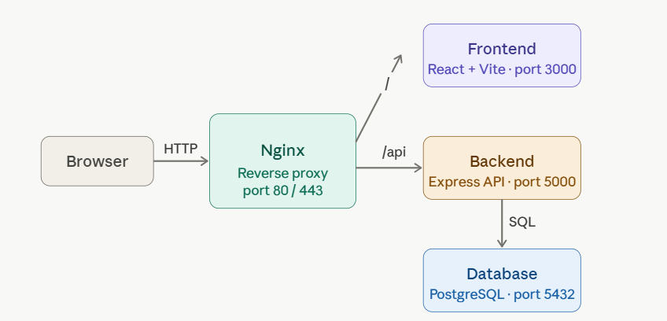

Here's the full 3-tier app with Docker best practices.**Project structure:**



## Project Structure
 
```
project/
├── frontend/
│   ├── Dockerfile
│   ├── nginx.conf           # Static file serving for React
│   ├── package.json
│   ├── vite.config.js
│   ├── index.html
│   └── src/
│       ├── main.jsx
│       └── App.jsx
├── backend/
│   ├── Dockerfile
│   ├── package.json
│   └── src/
│       └── index.js
├── nginx/
│   └── nginx.conf           # Reverse proxy config
├── .env                     # Local secrets (never commit)
├── .env.example             # Template to share with team
├── .gitignore
└── docker-compose.yml
```
---
 
## Prerequisites
 
- [Docker](https://docs.docker.com/get-docker/) v24+
- [Docker Compose](https://docs.docker.com/compose/) v2+
 

---

### `frontend/Dockerfile`
```dockerfile
# Stage 1 — build
FROM node:20-alpine AS builder
WORKDIR /app
COPY package*.json ./
RUN npm ci
COPY . .
RUN npm run build

# Stage 2 — serve
FROM nginx:1.25-alpine AS runner
COPY --from=builder /app/dist /usr/share/nginx/html
COPY nginx.conf /etc/nginx/conf.d/default.conf
EXPOSE 80
```

### `frontend/nginx.conf`
```nginx
server {
    listen 80;

    root /usr/share/nginx/html;
    index index.html;

    location / {
        try_files $uri $uri/ /index.html;
    }
}
```

### `frontend/src/App.jsx`
```jsx
import { useEffect, useState } from "react";

export default function App() {
  const [message, setMessage] = useState("");

  useEffect(() => {
    fetch("/api/health")
      .then((r) => r.json())
      .then((d) => setMessage(d.message));
  }, []);

  return <h1>{message || "Loading..."}</h1>;
}
```

---

### `backend/Dockerfile`
```dockerfile
FROM node:20-alpine AS builder
WORKDIR /app
COPY package*.json ./
RUN npm ci --only=production

FROM node:20-alpine AS runner
ENV NODE_ENV=production
WORKDIR /app
COPY --from=builder /app/node_modules ./node_modules
COPY src ./src
EXPOSE 5000
USER node
CMD ["node", "src/index.js"]
```

### `backend/src/index.js`
```js
import express from "express";
import pg from "pg";

const app = express();
app.use(express.json());

const pool = new pg.Pool({
  host: process.env.DB_HOST,
  port: Number(process.env.DB_PORT) || 5432,
  database: process.env.DB_NAME,
  user: process.env.DB_USER,
  password: process.env.DB_PASSWORD,
});

app.get("/api/health", async (_req, res) => {
  try {
    await pool.query("SELECT 1");
    res.json({ message: "API healthy — DB connected" });
  } catch {
    res.status(500).json({ message: "DB unreachable" });
  }
});

app.listen(5000, () => console.log("API running on :5000"));
```

### `backend/package.json`
```json
{
  "name": "backend",
  "type": "module",
  "scripts": { "start": "node src/index.js" },
  "dependencies": {
    "express": "^4.19.2",
    "pg": "^8.11.5"
  }
}
```

---

### `nginx/nginx.conf` (reverse proxy)
```nginx
upstream frontend { server frontend:80; }
upstream backend  { server backend:5000; }

server {
    listen 80;

    location / {
        proxy_pass         http://frontend;
        proxy_set_header   Host              $host;
        proxy_set_header   X-Real-IP         $remote_addr;
        proxy_cache_bypass $http_upgrade;
    }

    location /api/ {
        proxy_pass         http://backend;
        proxy_set_header   Host              $host;
        proxy_set_header   X-Real-IP         $remote_addr;
        proxy_read_timeout 60s;
    }
}
```

---

### `docker-compose.yml`
```yaml
services:

  nginx:
    image: nginx:1.25-alpine
    ports:
      - "80:80"
    volumes:
      - ./nginx/nginx.conf:/etc/nginx/conf.d/default.conf:ro
    depends_on:
      - frontend
      - backend
    restart: unless-stopped

  frontend:
    build:
      context: ./frontend
      target: runner
    expose:
      - "80"
    restart: unless-stopped

  backend:
    build:
      context: ./backend
      target: runner
    expose:
      - "5000"
    environment:
      DB_HOST:     db
      DB_PORT:     5432
      DB_NAME:     ${POSTGRES_DB}
      DB_USER:     ${POSTGRES_USER}
      DB_PASSWORD: ${POSTGRES_PASSWORD}
    depends_on:
      db:
        condition: service_healthy
    restart: unless-stopped

  db:
    image: postgres:16-alpine
    expose:
      - "5432"
    environment:
      POSTGRES_DB:       ${POSTGRES_DB}
      POSTGRES_USER:     ${POSTGRES_USER}
      POSTGRES_PASSWORD: ${POSTGRES_PASSWORD}
    volumes:
      - pg_data:/var/lib/postgresql/data
    healthcheck:
      test: ["CMD-SHELL", "pg_isready -U ${POSTGRES_USER} -d ${POSTGRES_DB}"]
      interval: 10s
      timeout: 5s
      retries: 5
    restart: unless-stopped

volumes:
  pg_data:
```

### `.env` (never commit — add to `.gitignore`)
```env
POSTGRES_DB=appdb
POSTGRES_USER=appuser
POSTGRES_PASSWORD=supersecret
```

---

**To run:**
```bash
cp .env.example .env          # fill in secrets
docker compose up --build -d
# open http://localhost

# To Rebuild and run
docker compose up --build -d

```
---
### Stop all services
 
```bash
docker compose down
```
 
To also remove the database volume:
 
```bash
docker compose down -v
```
 
## Services
 
| Service    | Image                  | Internal Port | Exposed |
|------------|------------------------|---------------|---------|
| `nginx`    | nginx:1.25-alpine      | 80            | 80      |
| `frontend` | node:20-alpine (build) | 80            | No      |
| `backend`  | node:20-alpine         | 5000          | No      |
| `db`       | postgres:16-alpine     | 5432          | No      |
 
> The database and app services are **not** exposed to the host — all traffic flows through Nginx.
 
---
 
## Environment Variables
 
| Variable            | Description               | Example        |
|---------------------|---------------------------|----------------|
| `POSTGRES_DB`       | PostgreSQL database name  | `appdb`        |
| `POSTGRES_USER`     | PostgreSQL username       | `appuser`      |
| `POSTGRES_PASSWORD` | PostgreSQL password       | `supersecret`  |
 
---
 
## Access and verify
 
| Method | Path          |
|--------|---------------|
| Open UI    | `http://localhost in browser` |
| GET    | `/api/health` | Health check — verifies DB conn |
| GET    | `/api/health` | Health check — verifies DB conn |
| GET    | `/api/health` | Health check — verifies DB conn |
| GET    | `/api/health` | Health check — verifies DB conn |
 
---
 
## Development Notes
 
### Logs
 
```bash
# All services
docker compose logs -f
 
# Single service
docker compose logs -f backend    # API errors
docker compose logs -f db         # Postgres errors
docker compose logs -f nginx      # Proxy errors
docker compose logs -f frontend   # Build errors
```
### Backend can't be reach
```
# Confirm DB is healthy
docker compose ps db

# Manually test connection from backend container
docker compose exec backend node -e "
import pg from 'pg';
const p = new pg.Pool({ host:'db', user:'appuser', password:'supersecret', database:'appdb' });
p.query('SELECT 1').then(() => console.log('OK')).catch(console.error);
"
```
### Rebuild a single service
 
```bash
docker compose up --build backend -d
```
 
### Access the database directly
 
```bash
docker compose exec db psql -U $POSTGRES_USER -d $POSTGRES_DB # replace variable with values
```
### Reset everything and start fresh
```
docker compose down -v        # removes containers + DB volume
docker compose up --build -d  # rebuild from scratch
```

---
## **Best practices applied:**
- Multi-stage builds — production images carry no dev dependencies or build tools
- Non-root `USER node` in the backend container
- DB port never exposed to the host — only internal Docker network
- Healthcheck with `depends_on` so backend waits for Postgres to be ready
- Named volume for Postgres data persistence
- `restart: unless-stopped` for resilience
- Secrets via `.env` file, not baked into images

## .gitignore
 
Add at minimum:
 
```
.env
node_modules/
```